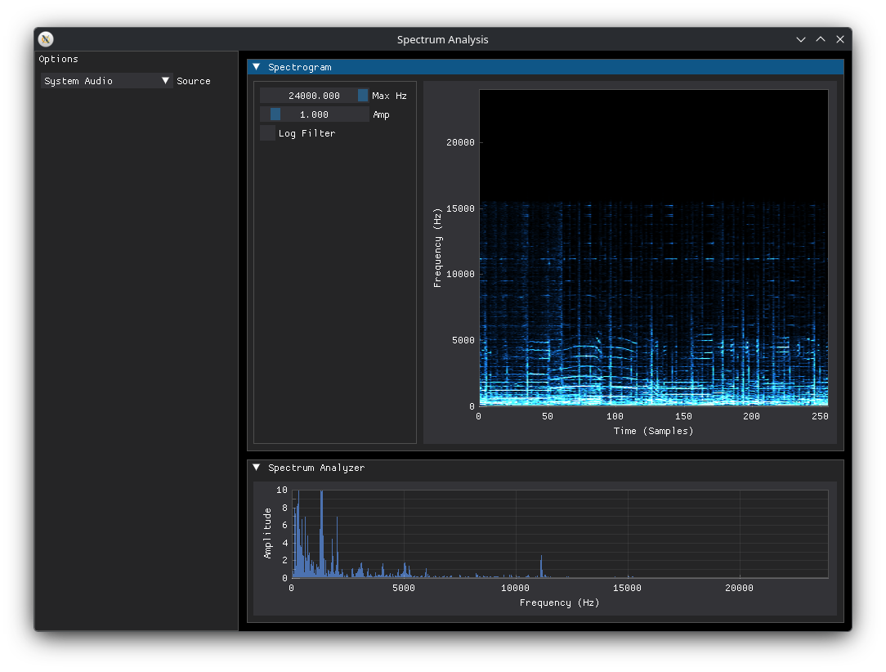

# spectrum-analysis

A simple spectrogram/audio visualizer built in Python as a foray into signal processing. A rewrite with DearPyGui is underway to address the lack of quantitative data. More views and analysis tools may be added in the near future.

## Run Locally

1. Clone the project

```bash
git clone https://github.com/PixelTomato/spectrum-analysis.git
```

2. Select project directory

```bash
cd spectrum-analysis
```

3. Install dependencies (consider a .venv)
```bash
pip install numpy soundcard dearpygui
```

4. Run

```bash
python main.py
```

## Compatibility
This project uses fully cross-platform libraries to maximize portability. It has been tested to work on macOS 27 beta 8 and Fedora 44. No Windows testing has been done at this time.

Additional permissions may be required on some systems, namely macOS. On such systems, loopback (system audio) recording may be disabled by the security policy. Warnings are currently printed to the console when the system lacks loopback recording support. The source selection dropdown won't be able to switch the input away from the default microphone in this case.
